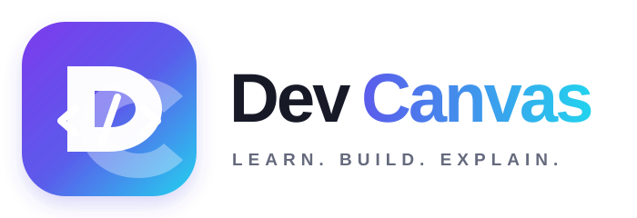

<p align="center">
  
</p>

<h1 align="center">DevCanvas</h1>

<p align="center">
  <strong>Learn. Build. Explain.</strong>
</p>

<p align="center">
  A responsive frontend engineering journal built with Next.js, featuring practical articles, topic-based discovery, custom visual headers, dark mode, and a demo moderation dashboard.
</p>

> **Portfolio project:** DevCanvas is an independent educational project created for frontend-development practice and portfolio presentation. Its authentication and moderation features are demonstrations only. The project does not provide real user accounts, persistent authentication, a production API, or database-backed content management.

## Overview

DevCanvas presents focused frontend-engineering articles through a polished, responsive reading experience. Visitors can search articles, filter content by topic, open statically generated article pages, switch between light and dark themes, and explore a demonstration moderation workflow.

Each article has a topic-specific visual identity, a responsive detail-page hero, structured metadata, and content written for its subject. The interface uses locally stored SVG assets, so article artwork does not depend on a remote image service at runtime.

## Features

### Article discovery

- Featured article section on the homepage
- Search by article title, excerpt, or author
- Topic filters for Next.js, React, JavaScript, CSS, UI/UX, and Accessibility
- Dynamically calculated article count, topic count, and average reading time
- Responsive card grid for desktop, tablet, and mobile layouts

### Reading experience

- Statically generated article routes using the Next.js App Router
- Responsive two-column article hero on desktop
- Stacked article hero on tablet and mobile screens
- Topic, author, publication date, and reading-time metadata
- Topic-specific article content instead of repeated placeholder sections
- Clear navigation back to the article collection

### Visual design

- Original DevCanvas logo and standalone brand mark
- Custom article-header artwork and locally stored SVG assets
- Topic-specific gradient treatments
- Layered grid, lighting, and background depth
- Light and dark themes
- Responsive typography and spacing
- Hover transitions with reduced-motion support

### Demo administration

- Demo login interface
- Session-based route protection
- Comment moderation dashboard
- Pending, approved, and hidden comment states
- Demo sign-out flow

## Article Topics

- **Next.js:** Route groups, layouts, and Server and Client Components
- **React:** State ownership and component boundaries
- **JavaScript:** Focused, readable utility functions
- **CSS:** Responsive components with container queries
- **UI/UX:** Calm interfaces for complex products
- **Accessibility:** Form feedback, focus management, and live updates

## Technology Stack

- Next.js 15
- React 19
- Tailwind CSS 4
- JavaScript
- CSS
- Next.js Image component
- ESLint
- Git and GitHub
- Vercel-ready deployment configuration

## Main Routes

- `/` - Homepage, featured article, search, and topic filters
- `/about` - Project overview
- `/articles/[slug]` - Statically generated article pages
- `/login` - Demo login page
- `/comments` - Demo moderation dashboard
- `/logout` - Demo sign-out flow

## Demo-Only Behavior

The login and comment-moderation experiences are included to demonstrate interface design, client-side interaction, and route organization. The current project does not include a production authentication provider, backend API, or database.

Any session-related state is temporary and intended only for local or portfolio demonstration.

## Getting Started

### Prerequisites

- Node.js 18.18 or later
- npm

### 1. Clone the repository

```bash
git clone https://github.com/NeerajSaini271/devcanvas-frontend-journal.git
```

### 2. Open the project directory

```bash
cd devcanvas-frontend-journal
```

### 3. Install dependencies

```bash
npm install
```

### 4. Start the development server

```bash
npm run dev
```

Open [http://localhost:3000](http://localhost:3000) in a browser.

## Validation

Run ESLint:

```bash
npm run lint
```

Create an optimized production build:

```bash
npm run build
```

The current version has passed ESLint and a complete Next.js production build, including static generation of all article routes.

## Project Structure

```text
DevCanvas/
├── app/
│   ├── (admin)/
│   │   ├── comments/
│   │   ├── login/
│   │   └── logout/
│   ├── about/
│   ├── articles/
│   │   └── [slug]/
│   ├── globals.css
│   ├── icon.svg
│   ├── layout.js
│   └── page.js
├── components/
│   ├── admin/
│   ├── articles/
│   ├── layout/
│   ├── theme/
│   └── ui/
├── data/
│   └── articles.js
├── public/
│   ├── article-icons/
│   ├── devcanvas-logo.svg
│   └── devcanvas-mark.svg
├── eslint.config.mjs
├── next.config.mjs
├── package.json
├── postcss.config.mjs
└── README.md
```

## Responsive Behavior

### Desktop

- Multi-column article grid
- Two-column featured article card
- Two-column article-detail hero with text and artwork
- Full desktop navigation

### Tablet

- Reduced article-grid columns
- Stacked featured content when space becomes limited
- Compact navigation controls
- Article-detail visual moves below the introduction at the responsive breakpoint

### Mobile

- Single-column article grid
- Full-width search and filter controls
- Mobile navigation drawer
- Stacked article-detail layout
- Responsive typography, artwork, and spacing

## Accessibility

- Visible keyboard-focus states
- Semantic article, section, header, navigation, and time elements
- Accessible labels for interactive controls
- Empty alternative text for decorative article artwork
- Keyboard-accessible navigation and filtering controls
- Reduced-motion support
- Accessible-form article content covering errors, focus movement, and live feedback
- Responsive layouts that avoid horizontal page overflow

## Branding and Visual Assets

- `public/devcanvas-logo.svg` contains the complete horizontal DevCanvas logo and tagline.
- `public/devcanvas-mark.svg` contains the compact standalone brand symbol.
- Article artwork is stored locally in `public/article-icons`.
- Brand icon sources and trademark notes are documented in [`public/article-icons/SOURCES.md`](public/article-icons/SOURCES.md).
- Third-party names and trademarks belong to their respective owners.

## Deployment

DevCanvas is ready to deploy on Vercel:

1. Import the GitHub repository into Vercel.
2. Keep the detected framework preset as **Next.js**.
3. Use the default build command: `npm run build`.
4. Deploy the project.

No environment variables are required for the current demo implementation.

After deployment, add the production URL and a final website preview image to this README.

## Author

**Neeraj Kumar Saini**  
MERN Stack Developer

- GitHub: [NeerajSaini271](https://github.com/NeerajSaini271)
- LinkedIn: [neerajsaini271](https://www.linkedin.com/in/neerajsaini271)
- Email: [neerajkhetrisaini@gmail.com](mailto:neerajkhetrisaini@gmail.com)
